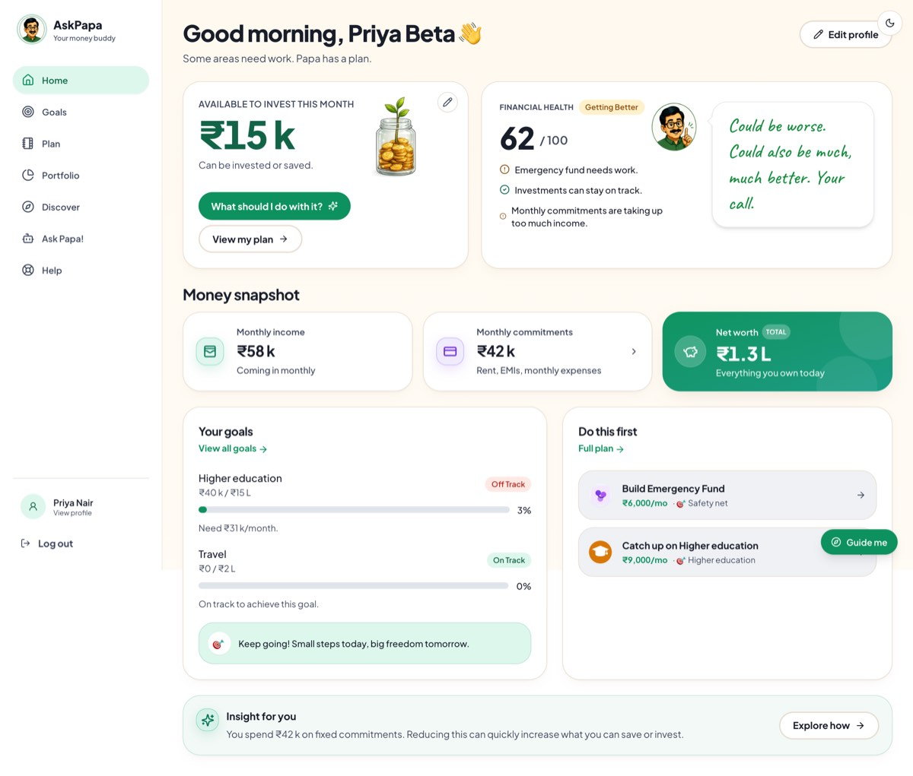
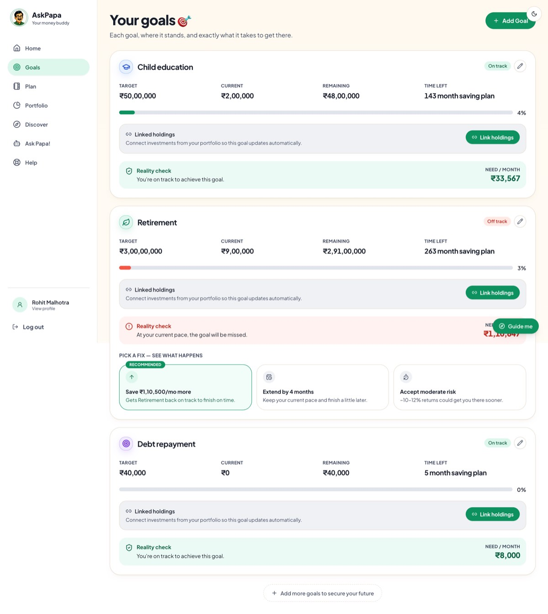
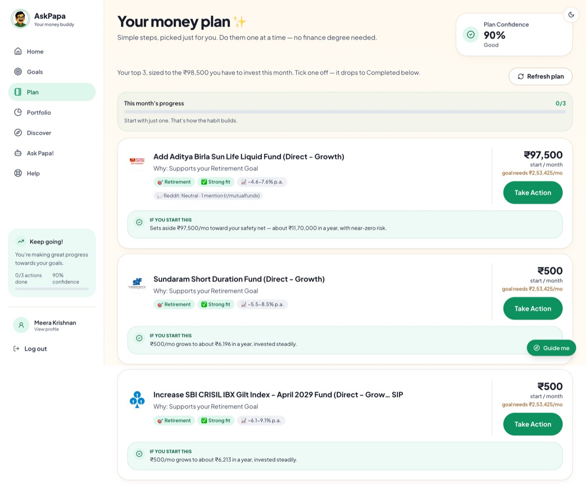
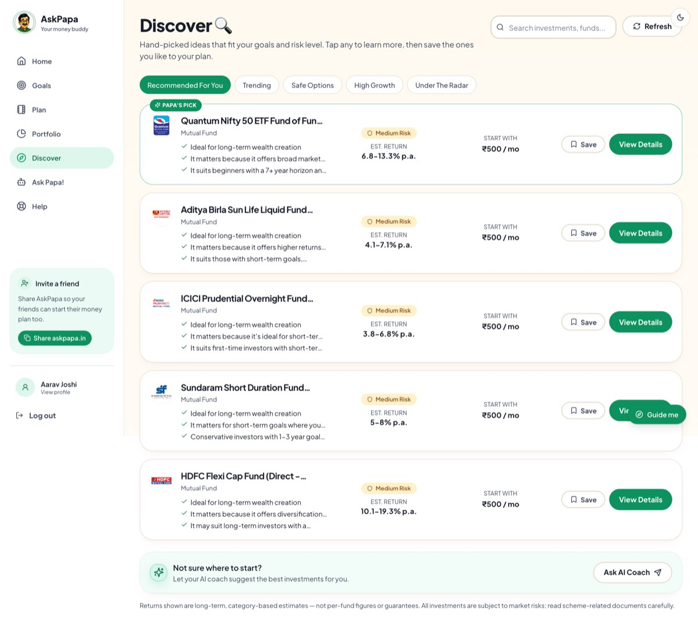
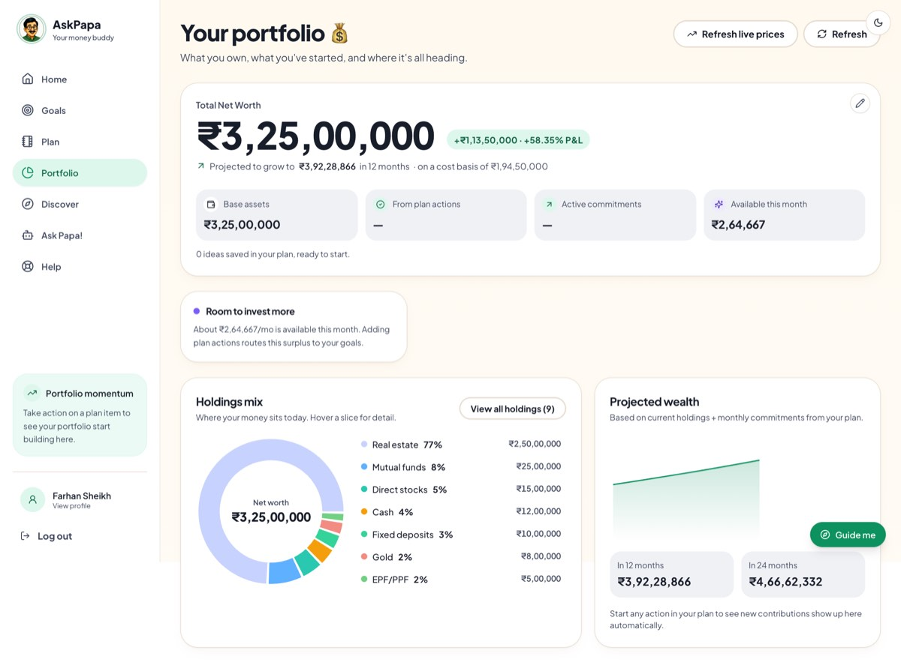
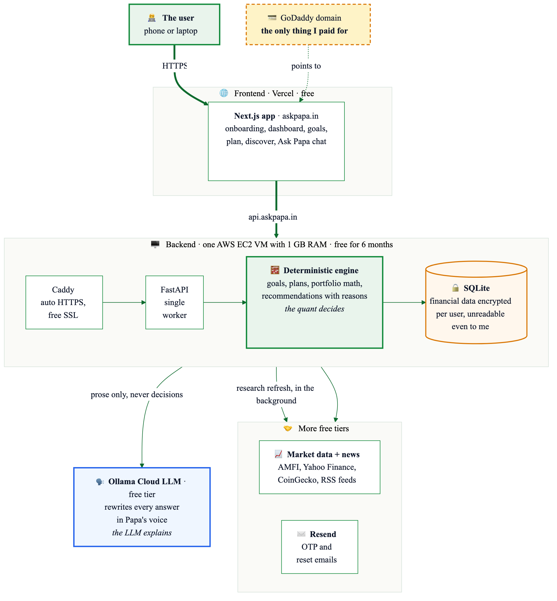

# I Built an AI Money Mentor That Talks Like an Indian Dad

*Gen Z spends first and saves whatever survives the month. AskPapa exists to flip that, by making where and how much to invest a no brainer. Here is the why, the product, and the stack that cost me nothing but a domain name.*

## Why I built this: we spend first and save never

Our parents had a simple rule: save first, spend what is left. Somewhere between UPI, food delivery, and one tap checkouts, my generation quietly inverted it. We spend first and save whatever survives the month. Often, nothing survives the month.

It is not carelessness. Ask around and you will hear the same two blockers on repeat.

**We do not know exactly what to do.** The salary arrives, the intention is genuine, but "start investing" is not an instruction. Invest in what? How much? For which goal? Nobody teaches this in college, and the ads that promise to teach it are usually selling something.

**And we are not going to research it.** Getting to a confident answer means comparing funds, decoding jargon, and reading fifty contradictory opinions on the internet. That is hours of effort for a decision you are scared of getting wrong. So the tab gets closed, and the money sits in a savings account slowly losing to inflation.

The result is a generation that earns well and still carries a quiet anxiety about money.

AskPapa is my answer to that. It is a personal finance app with exactly one job: make where to invest and how much a no brainer. You tell it about your life once. It hands you a plan: this much here, this much there, here is why, and you can start with ₹500 if that is all this month allows. The research, the comparison, the second guessing, all of it happens inside the app so it does not have to happen inside your head.

The trust part is right there in the name. For most of us, the first financial lessons came from one person: Papa. Fixed deposits, gold, "money does not grow on trees", all of it. We trust him not because he has certifications, but because he explains things patiently and he is unmistakably on our side. So I did not build a chatbot with a finance skin. I built Papa: a mustachioed Indian dad who looks at your actual numbers, tells you what to do next in plain language, and judges your food delivery spending only a little.

He is live at [askpapa.in](https://www.askpapa.in).

## The look and feel

This is the dashboard: how much you can invest this month, a financial health score, your goals, and the two or three things to do first. No candlestick charts, no ticker tape, no jargon. And in the corner, Papa's verdict on your 62 out of 100:

> "Could be worse. Could also be much, much better. Your call."

Finance apps usually fail at engagement because they inform without ever nudging. I designed AskPapa around a handful of deliberate engagement choices instead.

**One personality, everywhere.** Papa has thirteen moods and shows up on every screen: reacting while you fill onboarding forms, peeking in from the edge with commentary, celebrating when you finish setup. The persona is also a writing constraint. Every sentence in the app must pass one test: would a caring, slightly sarcastic dad say this? That single rule killed every piece of jargon in the product.

**Onboarding that feels like a chat, not a form.** Signing up is a friendly interview about your life. Every field a beginner could stumble on carries a plain language hint. EPF is explained as the retirement money your employer sets aside, not assumed knowledge. Instead of typing your holdings, you upload the statement your broker already gives you and Papa reads it. And wherever a question could freeze you, there is a "Not sure?" button. Ask someone what their dream trip costs and they blank; tap "Not sure?" and Papa asks the questions a person would ask (where to, how many of you, how many days) and suggests a realistic figure. In early testing his guess for a user's Sri Lanka trip was ₹12,00,000, which is bonkers. The fix, grounding his estimate in per person per day math and letting the AI only adjust within a sane band, brought it to ₹1,50,000. More on that discipline below.

**Every goal gets a reality check.** A goal that is off track does not just get a red badge. It gets three concrete fixes with their consequences: save more per month, extend the deadline, or accept more risk. You pick one and the plan updates. Agency, not guilt.

**Three actions a month, not thirty.** The Plan page compresses everything into three actions sized to the money you can actually spare, each with its reason and what happens if you start it. Tick one off and the progress bar moves. Nobody rebuilds their financial life in a weekend; almost anyone can do three things a month. Momentum is the feature.

**Reasons on every card.** The Discover page recommends specific instruments, and each card explains itself: why this fits you, its risk band, a realistic return range, and a starting amount, often ₹500 a month. There is a Papa's Pick on top and honest fine print at the bottom. People do not act because a score is high; they act when they understand why.

**The whole picture in one place.** Net worth, where your money sits, and what it becomes if you simply stay the course. Watching the projection line climb is its own nudge.

There is also a guided tour where Papa walks you through the app, and a chat where he answers anything, with your real numbers in mind and the previous conversation remembered. First time users get walked in; returning users get pulled back by having exactly three clear things to do.

## How I built it: free tiers all the way down

Here is my favourite part of the story. The total amount of money this app has cost me is the price of a domain name.

- **GoDaddy** for the domain. The only bill.
- **Vercel** hosts the Next.js frontend. Free.
- **AWS EC2** runs the backend, one small VM with 1 GB of RAM. Free for the first six months.
- **Ollama Cloud** serves a small open LLM. Free tier.
- **Resend** sends the OTP and password reset emails. Free tier.
- **Let's Encrypt** provides SSL on both domains, auto provisioned by Vercel and Caddy. Free.

The whole system fits in one picture:

Three ideas make this tiny footprint workable.

**The quant decides, the LLM explains.** Every answer in AskPapa is computed first by ordinary, deterministic code: the goal math, the health score, the recommendation engine, the chat baseline. The LLM's only job is to take a complete, correct answer and rewrite it in Papa's voice. It never chooses instruments, never invents numbers, never decides anything. That is what the "prose only, never decisions" arrow in the diagram means, and it is why the Sri Lanka fix worked: the estimate is anchored by code, and the AI can only adjust it within a sane band. It is also why a small free model is enough, and why failure is invisible. If the model times out or hits a quota, users get the deterministic answer in slightly plainer language, never an error. During one provider outage lasting hours, no user noticed anything.

**Privacy as architecture, not policy.** I run this service and I decided early that I should not be able to read anyone's financial data. Every user gets their own encryption key, sealed under their password; it travels in their session token and unlocks their data only for the duration of each request. Open the production database and you will find ciphertext where the financial data should be. A separate recovery mechanism means a forgotten password does not destroy your data. This is a property of the system, not a promise in a policy page.

**Boring infrastructure, deliberately.** SQLite instead of a managed database: zero operational overhead and trivial backups, perfectly happy at this scale. A single worker because SQLite prefers one writer. A swap file because the box has 1 GB of RAM. Caching at every layer, slow work pushed to the background, and graceful degradation on every external dependency. Boring choices, deliberately made, compounding quietly. Which, now that I think about it, is exactly the investment philosophy the app teaches.

## Key takeaways from the build

**Meet people at zero effort.** My generation will not do the research, and shaming them does not change that. The product that wins is the one that removes the research, not the one that assigns it as homework.

**Trust needs a face.** The same advice lands differently when it comes from someone you would trust. Papa works because the first financial voice in most Indian lives is a father figure. Borrow trust that already exists.

**Personality is a feature with an architecture.** Papa's voice needed prompt discipline, a post processing layer, and a fallback plan. Charm that collapses when the model hiccups is not charm.

**LLMs are a voice layer, not a brain.** The moment I stopped asking the model to think and started asking it to speak, quality went up, costs went down, and failures stopped mattering.

**Explanations convert.** Users act when the app says here is why, here is what could go wrong, and here is what to do about it. The reasons on every card took real effort and they are the thing users mention most.

**Constraints are a gift.** One small VM, a free model tier, and a zero budget forced an architecture that is simpler, faster, and more resilient than the one I would have built with money.

If you want to see Papa in action, he is at [askpapa.in](https://www.askpapa.in), waiting to judge your emergency fund. Lovingly, of course.

---

*If this was useful, a clap or a follow helps more people find it. I am happy to answer build questions in the responses.*
