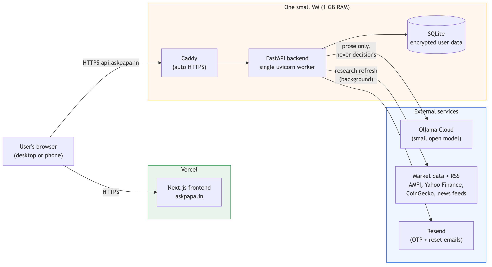
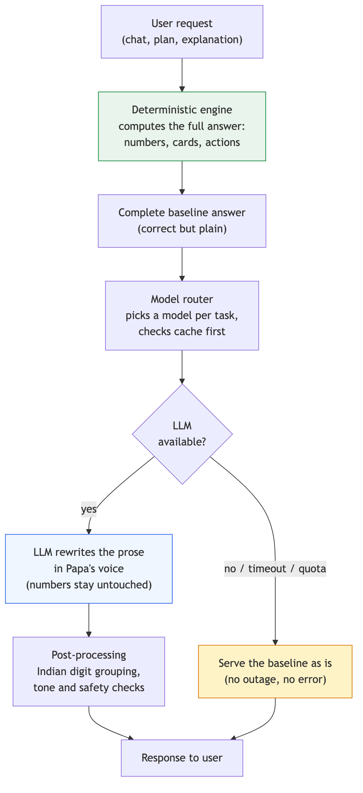
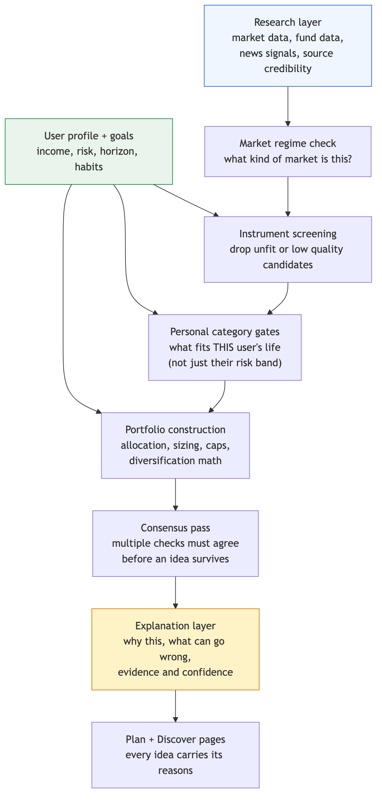
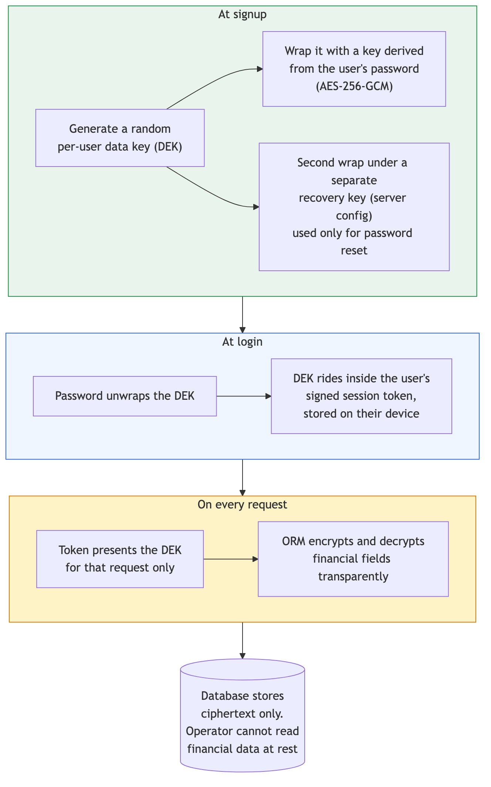

# I Built an AI Money Mentor That Talks Like an Indian Dad

*The story of AskPapa: why financial advice needed a personality transplant, what the product does, and how a 50,000 line codebase runs on a $0 monthly bill.*

Every Indian household has a money person. The uncle with stock tips. The colleague who swears by one mutual fund. The friend who says just buy gold. What almost nobody has is someone who will sit down, look at your actual numbers, and explain what to do next in plain language, without selling you anything.

I kept meeting people in their twenties and thirties who earn well and still feel a quiet anxiety about money. They are not lazy. They are stuck. Finance apps throw jargon at them, advisors have minimum ticket sizes, and the internet gives them fifty contradictory opinions. So they do nothing, and doing nothing quietly costs them years of compounding.

AskPapa is my answer to that. It is a personal finance app built around one idea: what if the guidance felt like a dad who actually explains things? Not a chatbot with a finance skin. A mentor with opinions, warmth, and a little dry humour, backed by a real analytical engine.

It is live at [askpapa.in](https://www.askpapa.in). This article covers the product first, then a technical deep dive for the builders.

---

## Part 1: The product

### Meet Papa

The entire app speaks in one voice. Papa is a mustachioed Indian father figure who shows up everywhere: he reacts while you fill onboarding forms, peeks from the edge of the screen with commentary, and delivers verdicts on your financial health with the exact energy of a dad reviewing your report card.

This is not decoration. The persona is a design constraint that forces every sentence in the app to pass a test: would a caring, slightly sarcastic father say this? That single rule killed every piece of jargon in the product. Nothing says "asset allocation drift detected." Papa says your investments are wandering and it is time for a word.

The tone lands because it is honest. When your financial health score is 62 out of 100, Papa's speech bubble reads: "Could be worse. Could also be much, much better. Your call."

### Onboarding that feels like a conversation

Signing up walks you through a friendly interview: who you are, what you earn, what you spend, what you own, what you dream about, and how you behave with money. Every question is in plain language. Every field that could confuse a beginner carries a hint. EPF is explained as the retirement money your employer sets aside, not assumed knowledge.

Two details I am particularly fond of:

**The "Not sure?" buttons.** Ask someone what their wedding will cost and most people freeze. So next to the target amount, a small button lets Papa estimate it. He asks a couple of quick questions, the kind a real person would ask: which city, what scale, how many days the trip is, and then produces a realistic figure with a range and its reasoning. During testing, a user typed "Sri Lanka trip" as a custom goal and the early version suggested ₹12,00,000, which is bonkers for a week abroad. The fix taught me a lot about grounding AI estimates, and I cover it in the technical half. Today the same goal lands near ₹1,50,000, which is what the trip actually costs.

**Statement upload.** Instead of typing every holding, you upload the portfolio statement your broker or fund platform already gives you. The app parses it, shows you what it found, lets you correct anything, and merges multiple brokers into one portfolio with live valuations.

### Goals with a reality check

Each goal gets its own card: target, progress, time left, and the monthly amount it actually needs. When a goal is off track, the app does not just show a red badge. It offers three concrete fixes with their consequences: save more per month, extend the deadline, or accept more risk. You pick one and the plan updates.

### A plan, not a lecture

The Plan page turns everything into three actions for the month, sized to the money you can actually spare. Each action says why it exists, which goal it serves, and what happens if you start it. Tick one off and it moves to completed. The idea is momentum: nobody rebuilds their financial life in a weekend, but almost anyone can do three things a month.

### Discover, with reasons attached

The Discover page recommends specific instruments, and every card explains itself: why this fits you, what risk band it sits in, what the realistic return range looks like, and what you could start with, often as low as ₹500 a month. There is a "Papa's Pick" at the top and honest fine print at the bottom reminding you that estimates are estimates.

The portfolio view brings it together: net worth, holdings mix, projected wealth if you stay the course, and how much room you have to invest this month.

And when you have a question that no dashboard answers, you ask Papa directly in chat. He knows your numbers, remembers the conversation, and answers like a person, not a search engine.

---

## Part 2: For the builders

Here is the part I wish more product stories included. AskPapa is a Next.js frontend, a FastAPI backend, a SQLite database, and a small open LLM. About 50,000 lines of code: roughly 28,000 lines of Python across 295 files on the backend, and 21,000 lines of TypeScript on the frontend. It serves real users on infrastructure that costs nothing per month.

### The shape of the system

The frontend lives on Vercel's free tier. The backend is one small virtual machine with 1 GB of RAM, running a single uvicorn worker behind Caddy, which handles HTTPS certificates automatically. The database is a SQLite file on that same machine, backed up nightly. The LLM is a small open model on Ollama Cloud's free tier. Email goes through Resend's free tier.

People sometimes flinch at SQLite in production. For a single writer workload at this scale it is honestly great: zero operational overhead, trivial backups, and one less service to babysit at three in the morning. The 1 GB box works because of one deliberate constraint you will see next: the request path never waits on anything heavy.

### The core pattern: the quant decides, the LLM explains

This is the single most important architectural decision in the app, and I would repeat it in any AI product I build.

Every answer in AskPapa is computed deterministically first. The recommendation engine, the goal math, the health score, the chat baseline: all of it is ordinary code with ordinary tests. The LLM's only job is to take a complete, correct answer and rewrite the prose in Papa's voice. It never chooses instruments, never invents numbers, never decides anything.

The consequences are lovely:

- **Failure is invisible.** If the LLM times out, hits a quota, or returns nonsense, the user gets the deterministic answer. Slightly plainer language, same substance, no error screen. During one production incident the model provider was down for hours and no user noticed.
- **Small models are enough.** Because the model only rewrites prose from structured context, a small open model does the job. There is no need for a frontier model when the hard thinking already happened in code.
- **Costs stay near zero.** LLM calls are cached by prompt, batched, and mostly run in the background after the response is already served. The expensive path is the exception, not the rule.

A model router picks a model per task with per task time budgets, so chat stays snappy while background explanation work gets more room. Post processing fixes the things small models reliably get wrong for an Indian audience, like digit grouping: ₹2,34,000, not ₹234,000.

That Sri Lanka trip bug from Part 1? The estimator originally asked too few clarifying questions and let the model guess with too little context. The fix was pure engineering: ask for the cost drivers (destination, people, days, style of stay), compute a deterministic per person per day baseline in code, and let the model only adjust within a sane band of it. Grounding beats scale.

### Life of a recommendation

The recommendation engine is the deepest part of the backend: a pipeline of dozens of small, composable agents, each doing one deterministic job.

Conceptually it flows like this. A research layer continuously ingests market data, fund data, and news from public Indian sources, and scores the credibility of what it reads. A regime check asks what kind of market we are in. Screening drops unfit or low quality candidates. Then comes the step I care most about: personal category gates. Two users with the same risk score do not get the same list, because the engine reasons about their lives, not just their risk band. A tax saving fund makes no sense below the tax threshold. Small caps make no sense for someone three months from needing the money.

Portfolio construction then does the allocation and sizing math with diversification constraints, a consensus pass requires multiple independent checks to agree before an idea survives, and an explanation layer attaches the evidence: why this, what could go wrong, how confident the system is, and which sources fed the view. That explanation object is what renders as the reasons on every card in the app.

None of this needed machine learning in the trendy sense. It needed careful domain modelling, honest uncertainty handling, and the discipline to show your work.

### Privacy as architecture, not policy

I run this service, and I decided early that I should not be able to read anyone's financial data. Not as a promise in a privacy policy, but as a property of the system.

Every user gets a random data encryption key at signup. That key is stored only in wrapped form, sealed with AES-256-GCM under a key derived from the user's password. The raw key travels inside the user's signed session token, which lives on their device, and is presented back to the server on each request. A middleware exposes it to the ORM for that request only, and the ORM encrypts and decrypts financial fields transparently.

The result: if you open the production database file, you see ciphertext where the financial data should be. The operator, me, cannot read it at rest. Identity fields like name and email stay readable on purpose, because support has to be possible.

One wrinkle is worth sharing. Pure password wrapped encryption has a brutal edge case: forget your password, lose your data. That is correct cryptographic behaviour and terrible product behaviour. The compromise is a second wrap of the same key under a separate recovery key that lives only in server configuration and is used exclusively during the emailed password reset flow. Password resets keep your data. It is a deliberate trade of a little theoretical purity for a lot of user safety.

### Running it for nothing

The bill, itemised: Vercel free tier for the frontend. A free tier cloud VM for the backend. Ollama Cloud free tier for the model. Resend free tier for email. Let's Encrypt certificates on both domains, provisioned automatically. The only thing I actually paid for is the domain name.

The engineering that makes free viable is unglamorous: a swap file because the box has 1 GB of RAM, a single worker because SQLite prefers one writer, caching at every layer, background processing for anything slow, and graceful degradation for every external dependency. Boring choices, deliberately made, compounding quietly. Which, now that I think about it, is also the entire investment philosophy the app teaches.

---

## What building this taught me

**Personality is a feature with an architecture.** Papa's voice needed a prompt discipline, a post processing layer, and a fallback plan. Charm that collapses when the model hiccups is not charm.

**LLMs are a voice layer, not a brain.** The moment I stopped asking the model to think and started asking it to speak, quality went up, costs went down, and failures stopped mattering.

**Trust is built in the explanation.** Users do not act on recommendations because a score is high. They act when the app says here is why, here is what could go wrong, and here is the evidence. The explanation layer took real effort and it is the part users mention most.

**Constraints are a gift.** One small VM, a free model tier, and a zero budget forced an architecture that is simpler, faster, and more resilient than the one I would have built with money.

There is plenty ahead: richer market intelligence, deeper document understanding, and the long tail of making every Papa sentence feel human. But the foundation held up to real users, real markets, and real production incidents, and it did so on pocket change.

If you want to see Papa in action, he is at [askpapa.in](https://www.askpapa.in), waiting to judge your emergency fund. Lovingly, of course.

---

*If this was useful, a clap or a follow helps more people find it. I am happy to answer architecture questions in the responses.*
