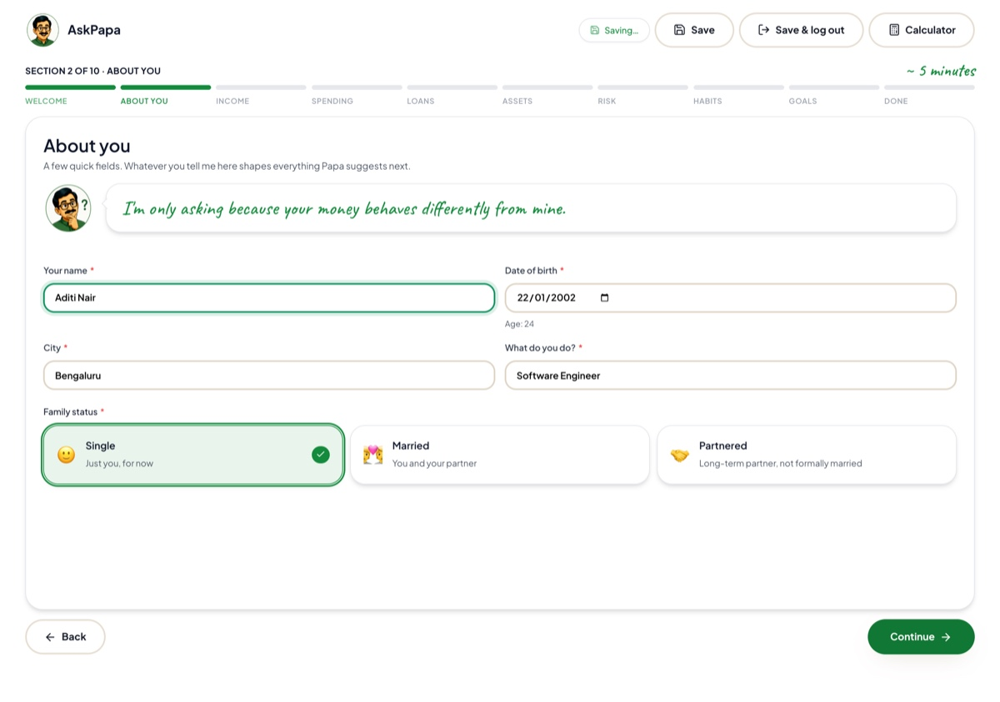
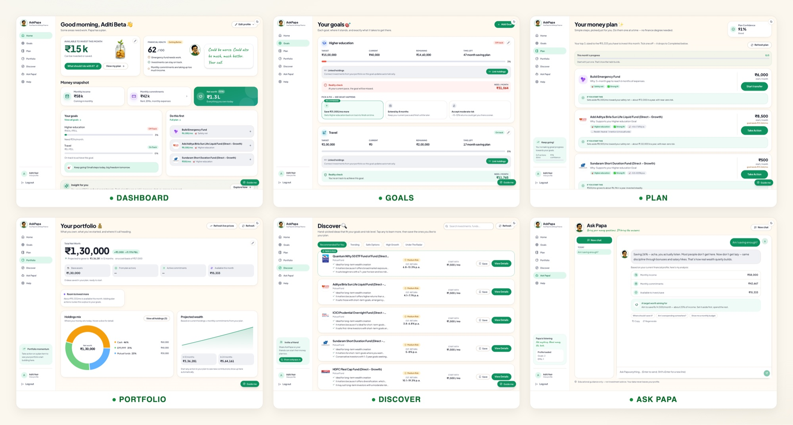

# I Built an AI Money Mentor That Talks Like an Indian Dad

*Gen Z spends first and saves whatever survives the month. AskPapa exists to flip that, by making where and how much to invest a no brainer. Here is the why, the product, and the stack that cost me nothing but a domain name.*

## Why I built this: we spend first and save never

Our parents had a simple rule: save first, spend what is left. Somewhere between UPI, food delivery, and one tap checkouts, my generation quietly inverted it. We spend first and save whatever survives the month. Often, nothing survives the month.

It is not carelessness. Ask around and you will hear the same two blockers on repeat.

**We do not know exactly what to do.** The salary arrives, the intention is genuine, but "start investing" is not an instruction. Invest in what? How much? For which goal? Nobody teaches this in college, and the ads that promise to teach it are usually selling something.

**And we are not going to research it.** Getting to a confident answer means comparing funds, decoding jargon, and reading fifty contradictory opinions on the internet. That is hours of effort for a decision you are scared of getting wrong. So the tab gets closed, and the money sits in a savings account slowly losing to inflation.

The result is a generation that earns well and still carries a quiet anxiety about money.

AskPapa is my answer to that. It is a personal finance app with exactly one job: make where to invest and how much a no brainer. You tell it about your life once. It hands you a plan: this much here, this much there, here is why, and you can start with ₹500 if that is all this month allows. The research, the comparison, the second guessing, all of it happens inside the app so it does not have to happen inside your head.

The trust part is right there in the name. For most of us, the first financial lessons came from one person: Papa. Fixed deposits, gold, "money does not grow on trees", all of it. We trust him not because he has certifications, but because he explains things patiently and he is unmistakably on our side. So I did not build a chatbot with a finance skin. I built Papa: a mustachioed Indian dad who looks at your actual numbers, tells you what to do next in plain language, and judges your food delivery spending only a little.

He is live at [askpapa.in](https://www.askpapa.in).

## The look and feel

The experience starts before you have typed a single number. Signing up is not a form, it is a short interview with Papa.

Every screen of that interview carries Papa's voice and, crucially, a reason for each question: "I'm only asking because your money behaves differently from mine." Ten short sections, about five minutes, auto saved, pause anytime. Every word a beginner could stumble on is explained in plain language, so EPF becomes the retirement money your employer sets aside rather than assumed knowledge. Instead of typing your holdings you upload the statement your broker already gives you and Papa reads it. And wherever a question could freeze you, there is a "Not sure?" button: ask someone what their dream trip costs and they blank, so tap it and Papa asks what a real person would ask (where to, how many of you, how many days) and suggests a realistic figure. In early testing his guess for a user's Sri Lanka trip was ₹12,00,000, which is bonkers; grounding the estimate in per person per day math and letting the AI only nudge within a sane band brought it to ₹1,50,000. The privacy promise is stated right there on the welcome screen too: your money details are locked with your password before they are saved, unreadable even to the team behind AskPapa. More on both of those below.

Then the product itself. Six screens, one personality, and not a single candlestick chart in sight.

**Dashboard.** How much you can invest this month, a financial health score, your goals, and the two or three things to do first. In the corner, Papa's blunt verdict on Aditi's 62 out of 100: "Could be worse. Could also be much, much better. Your call."

**Goals.** Each goal, where it stands, and exactly what it takes to get there. A goal that is off track does not just get a red badge, it gets three concrete fixes with their consequences: save more per month, extend the deadline, or accept more risk. You pick one and the plan updates. Agency, not guilt.

**Plan.** Everything compressed into three actions a month, sized to the money you can actually spare, each with its reason and what happens if you start it. Tick one off and the progress bar moves. Nobody rebuilds their financial life in a weekend, but almost anyone can do three things a month. Momentum is the feature.

**Portfolio.** Net worth, where your money sits today, and what it becomes if you simply stay the course. Watching that projection line climb is its own kind of nudge.

**Discover.** Specific instruments, each card explaining itself: why this fits you, its risk band, a realistic return range, and a starting amount, often ₹500 a month. A Papa's Pick sits on top and honest fine print at the bottom. People do not act because a score is high, they act when they understand why.

**Ask Papa.** A chat that answers anything with your real numbers in mind and the last conversation remembered. Ask "Am I saving enough?" and you do not get a lecture, you get Papa's verdict, your actual income, commitments and surplus laid out, and a specific target to aim for.

Running underneath all six is the same set of deliberate engagement choices. One personality on every screen, because Papa has thirteen moods and reacts as you go. The persona doubles as a writing constraint: every sentence must pass one test, would a caring, slightly sarcastic dad say this, and that single rule killed every piece of jargon in the product. First time users get walked in by a guided tour; returning users get pulled back by having exactly three clear things to do.

## How I built it: free tiers all the way down

Here is my favourite part of the story. The total amount of money this app has cost me is the price of a domain name.

- **GoDaddy** for the domain. The only bill.
- **Vercel** hosts the Next.js frontend. Free.
- **AWS EC2** runs the backend, one small VM with 1 GB of RAM. Free for the first six months.
- **Ollama Cloud** serves a small open LLM. Free tier.
- **Resend** sends the OTP and password reset emails. Free tier.
- **Let's Encrypt** provides SSL on both domains, auto provisioned by Vercel and Caddy. Free.

The whole system fits in one picture:

Read it as three zones, left to right.

**Zone 1, data ingestion and enrichment,** runs quietly in the background. Free data sources feed in: market data APIs (AMFI, Yahoo Finance, CoinGecko), news and regulator RSS (RBI, SEBI, NSE), and investor sentiment from Indian investing communities on Reddit, because that is where retail opinion actually lives. Everything ingested passes through content extraction and a financial NLP layer (entities, sentiment, contradiction detection), gets a source credibility score, and lands in an evidence and research store where every signal stays linked to where it came from and is reusable across users.

**Zone 2, core intelligence,** is the multi agent recommendation pipeline, and this is where the quant decides. Seven stages take your profile plus that evidence and turn them into a plan: profile and goals, market regime, screening and alpha discovery, a category planner that gates what actually fits your life, portfolio construction, a fusion and consensus step where multiple agents must agree before an idea survives, and finally an explainability agent that attaches reasons, risks and confidence to every card.

**Zone 3, interface and delivery,** is what you touch. The Next.js frontend on Vercel talks to a single FastAPI worker behind Caddy on one small AWS EC2 box. Ask Papa chat builds context from your real numbers, goals and latest recommendations, drafts a complete deterministic answer, and only then hands it over to be voiced. Everything sensitive lands in an encrypted SQLite database, an adaptive memory layer watches for drift and triggers reassessments, Resend sends the OTP and reset emails, and the GoDaddy domain, the one thing I paid for, points at all of it.

The two thick green arrows in the diagram are the entire thesis: the explainability agent and the chat both send the language model prose only, never decisions.

Three ideas make this tiny footprint workable.

**The quant decides, the LLM explains.** Every answer in AskPapa is computed first by ordinary, deterministic code: the goal math, the health score, the recommendation engine, the chat baseline. The LLM's only job is to take a complete, correct answer and rewrite it in Papa's voice. It never chooses instruments, never invents numbers, never decides anything. That is what the "prose only, never decisions" arrow in the diagram means, and it is why the Sri Lanka fix worked: the estimate is anchored by code, and the AI can only adjust it within a sane band. It is also why a small free model is enough, and why failure is invisible. If the model times out or hits a quota, users get the deterministic answer in slightly plainer language, never an error. During one provider outage lasting hours, no user noticed anything.

**Privacy as architecture, not policy.** I run this service and I decided early that I should not be able to read anyone's financial data. Every user gets their own encryption key, sealed under their password; it travels in their session token and unlocks their data only for the duration of each request. Open the production database and you will find ciphertext where the financial data should be. A separate recovery mechanism means a forgotten password does not destroy your data. This is a property of the system, not a promise in a policy page.

**Boring infrastructure, deliberately.** SQLite instead of a managed database: zero operational overhead and trivial backups, perfectly happy at this scale. A single worker because SQLite prefers one writer. A swap file because the box has 1 GB of RAM. Caching at every layer, slow work pushed to the background, and graceful degradation on every external dependency. Boring choices, deliberately made, compounding quietly. Which, now that I think about it, is exactly the investment philosophy the app teaches.

## Key takeaways from the build

**Start before you have a plan.** I opened my laptop to try vibe coding with no idea what to build. A month later it was a live product. Motion beats intention.

**Be your own first user.** I built AskPapa because my own money was a mess, so I always knew what to fix next. Solve your problem well and you have probably solved a stranger's too.

**One good character beats a hundred features.** People did not warm to a finance app, they warmed to a dad who explains. A personality people trust carries more than any feature list.

**Perfection is what shipped it.** I only meant to try something for a weekend. Refusing to leave it "good enough" is what turned a toy into a product.

**Starting was the only real cost.** A domain name was the only thing I paid for. The tools are free and the models are free, so the rest was just showing up after work.

If you want to see Papa in action, he is at [askpapa.in](https://www.askpapa.in), waiting to judge your emergency fund. Lovingly, of course.

---

*If this was useful, a clap or a follow helps more people find it. I am happy to answer build questions in the responses.*
